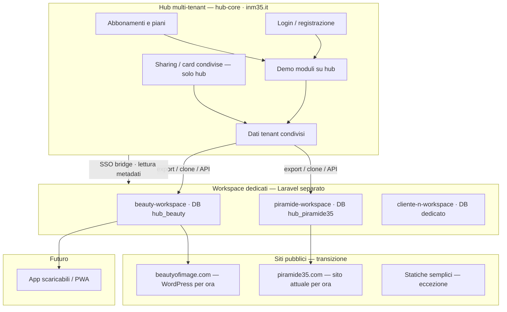

# Piano di sviluppo M35 Hub

> Documento di riferimento condiviso (locale + produzione via Git su Plesk).  
> Ultimo aggiornamento: **maggio 2026**  
> Repo: [hub-core](https://github.com/m-3-5/hub-core) → deploy su **inm35.it**

---

## 1. Visione

**Hub** = piattaforma multi-tenant dove i clienti si registrano, provano i servizi in demo o abbonamento, e accumulano dati.

**Premium / “tutto mio”** = progetto **Laravel dedicato** con **database proprio**, deploy separato. L’hub può **leggere** informazioni aggregate sull’azienda e **esportare/clonare** i dati quando il cliente passa al piano dedicato.

**Regola tecnologica:** tutto ciò che è “serio” (promo, agenda, affitti, shop, sharing, siti strutturati) → **Laravel**. Solo le **paginette statiche** semplici restano fuori da questo stack.

**Clienti premium attuali:** Beauty of Image, Piramide 35.

---

## 2. Architettura (schema)



---

## 3. Tre livelli commerciali (per ogni servizio)

| Livello | Nome | Dove vive | Modello |
|--------|------|-----------|---------|
| **0** | Demo | Hub multi-tenant | Gratuito / limitato |
| **1** | Abbonamento | Hub multi-tenant | Canone mensile, dati su hub |
| **2** | Tutto mio | Laravel dedicato + DB proprio | Setup + hosting; dati clonati dall’hub |

### Flusso tipo (es. Agenda)

1. Cliente si registra su **inm35.it** → prova **Agenda** in demo.
2. Usa appuntamenti e clienti sull’hub (abbonamento).
3. **Resta in abbonamento** → continua sull’hub.
4. **Vuole tutto suo** → si clona `agenda-base` + import dati del tenant → `agenda-cliente.it`.

Stesso schema per: **Promo**, **Affitti**, **Shop**, **Sito web**, **Sharing**.

---

## 4. Hub vs workspace dedicato

| Cosa | Hub (`hub-core`) | Workspace premium (Laravel dedicato) |
|------|------------------|--------------------------------------|
| Login centrale | ✅ | Bridge SSO dall’hub |
| Registro tenant, piani, billing | ✅ | Riceve solo riferimento (`tenant_id`, `plan`) |
| Demo / abbonamento moduli | ✅ | — |
| Promo, prodotti, agenda del cliente | Copia durante uso hub | ✅ fonte di verità dopo il fork |
| Sharing / card cross-tenant | ✅ sempre hub | Integrazione via API hub |
| Deploy hub | Non tocca i workspace | Indipendente |
| Sito pubblico | Embed / API verso WP o statico | Laravel o statico generato |

### Cosa significa “io pesco informazioni dall’hub”

L’hub mantiene il **registro centrale** di ogni azienda:

- slug, nome, dominio, colori, moduli attivi, piano (`demo` | `subscription` | `dedicated`)
- utenti e permessi (`tenant_user`)
- per i dedicati: URL workspace, stato sync, ultimo export
- **Sharing**: rete card/sconti tra strutture (dati cross-tenant solo su hub)

Il workspace premium **non sostituisce** l’hub per identità e servizi di rete; **sostituisce** l’hub per i dati operativi del modulo forkato.

---

## 5. Moduli e repository (target)

| Modulo | Hub (demo/abbonamento) | Template fork (`*-base`) | Note |
|--------|------------------------|--------------------------|------|
| **Promo** | ✅ attivo | `hub-module-promo` | Beauty, Piramide primi fork |
| **Servizi** | pianificato | `hub-module-services` | Listino trattamenti |
| **Shop** | pianificato | `hub-module-shop` | Stripe |
| **Agenda** | pianificato | `hub-module-agenda` | Prenotazioni |
| **Affitti** | pianificato | `hub-module-affitti` | Da generalizzare Serenella |
| **Sito web** | pianificato | statico o Laravel | Form + IA per base |
| **Annunci** | pianificato | `hub-module-classifieds` | Bakeca |
| **Gift card** | pianificato | `hub-module-giftcard` | |
| **Sharing** | pianificato | vedi §6 | Resta ancorato all’hub |

### Repo previsti

```
hub-core                 → piattaforma (questo repo)
beauty-workspace         → Laravel dedicato Beauty
piramide-workspace       → Laravel dedicato Piramide
hub-module-agenda        → template agenda (fork)
hub-module-affitti       → template affitti (fork)
…
```

Codice condiviso tra hub e fork: **package Composer** (`m35/hub-promo`, ecc.) per non duplicare bugfix.

---

## 6. Sharing (card clienti / sconti condivisi)

Modulo hub: **Card clienti** (`loyalty` in `config/hub.php`) — tessere fedeltà e sconti **tra più strutture**.

### Perché resta sull’hub (anche con clienti premium)

Lo sharing è **cross-tenant** per natura: una card valida in Beauty e in un altro centro. Non ha senso duplicarlo in ogni DB dedicato.

| Aspetto | Scelta |
|---------|--------|
| Dati card, rete partner, validazioni | **DB hub** (`hub_core`) |
| Negozio premium | Legge/scrive via **API hub** (`/api/sharing/...`) |
| Piano abbonamento | Sharing incluso o add-on su hub |
| Piano “tutto mio” | Moduli locali dedicati + **connettore Sharing** verso hub |

### Evoluzione commerciale Sharing

- **Demo:** poche card, pochi partner, limiti su hub.
- **Abbonamento:** rete attiva, gestione su hub.
- **Tutto mio:** fork moduli operativi (shop, promo…) + **sharing sempre su hub** (o contratto enterprise con replica — non prioritario).

Tecnologia: **Laravel** (stesso stack), mai WordPress per questo servizio.

---

## 7. Domini e transizione (Beauty & Piramide)

### Situazione attuale (non cambiare subito)

| Cliente | Sito pubblico (resta) | Hub / workspace |
|---------|----------------------|-----------------|
| Beauty | **beautyofimage.com** (WordPress) | promo su hub-core |
| Piramide | **piramide35.com** (sito attuale) | promo su hub-core |

### Strategia domini — risposta breve

**Sì:** si può partire con un **sottodominio** e spostare dopo sul **dominio definitivo** senza rifare il progetto. Basta configurazione (DNS + `.env` + certificato SSL), non riscrittura del codice.

### Fasi consigliate

#### Fase A — Ora (transizione)

Usare sottodomini **sotto inm35.it** per i workspace Laravel (zero impatto sui siti live):

| Cliente | Workspace admin (nuovo Laravel) | Sito pubblico (invariato) |
|---------|--------------------------------|---------------------------|
| Beauty | `beautyofimage.inm35.it` | beautyofimage.com |
| Piramide | `piramide35.inm35.it` | piramide35.com |
| Hub | `inm35.it` | — |

Vantaggi: DNS tutto sotto il vostro Plesk, nessuna modifica sui domini dei clienti, SSL immediato.

#### Fase B — Workspace sul dominio del cliente (quando pronti)

Aggiungere un record DNS sul dominio **loro** (es. nel pannello del registrar):

```
app.beautyofimage.com  →  CNAME o A verso server Plesk
```

Su Plesk: **alias di dominio** sullo stesso sito Laravel (`beauty-workspace`).

Aggiornare:

- `APP_URL=https://app.beautyofimage.com`
- `SESSION_DOMAIN` / cookie se necessario
- URL nei bridge WordPress e webhook promo
- `tenants.settings.workspace_url` nell’hub

**I dati e il database non cambiano.** È lo stesso deploy, nuovo hostname.

#### Fase C — Sito pubblico su Laravel (futuro)

Quando rifate **beautyofimage.com**:

1. Il workspace Laravel già esiste (`app.beautyofimage.com`).
2. Si aggiunge la parte **pubblica** (landing, promo, shop) nello stesso progetto o in deploy parallelo.
3. Si punta la **root** `beautyofimage.com` al `public/` Laravel (o reverse proxy).
4. WordPress viene dismesso o reindirizzato (301).

Stesso percorso per **piramide35.com**.

### Regola d’oro per il codice

**Mai hardcodare** `inm35.it` o domini cliente nel codice. Usare sempre:

- `APP_URL`
- `config/hub.php` / `tenants.settings`
- `PromoLinks`, webhook, bridge → da configurazione

Così la migrazione dominio è **solo ops**, non sviluppo.

### Schema transizione domini

```
OGGI
  inm35.it                    → hub-core
  beautyofimage.com           → WordPress (pubblico)
  piramide35.com              → sito attuale

STEP 1 — workspace M35
  beautyofimage.inm35.it      → beauty-workspace (admin + API)
  piramide35.inm35.it         → piramide-workspace

STEP 2 — workspace sul dominio cliente
  app.beautyofimage.com       → stesso beauty-workspace
  app.piramide35.com          → stesso piramide-workspace

STEP 3 — sito definitivo (dopo)
  beautyofimage.com           → Laravel pubblico (+ app. o stesso deploy)
  piramide35.com              → Laravel pubblico
```

---

## 8. Comunicazione hub ↔ workspace

| Meccanismo | Uso |
|------------|-----|
| **SSO bridge** | Login da hub o da WordPress → workspace (già previsto per WP) |
| **Export / clone** | `hub:export-tenant {slug} --module=promo` → import nel workspace |
| **API lettura** | Hub legge stato promo pubblicate, metadati azienda |
| **Webhook** | Workspace notifica hub (opzionale) |
| **Sharing API** | Workspace premium chiama hub per card/sconti di rete |

Sync continuo bidirezionale: **non prioritario**. Preferire export al fork + eventuale API leggera.

---

## 9. Piano di sviluppo per fasi

### Fase 0 — Stabilizzazione hub (in corso)

- [x] Shell multiservizio, auth, moduli UI
- [x] Promo Beauty + Piramide su hub
- [x] WordPress embed / webhook Beauty
- [ ] Budget IA per promo + fallback immagini (upload / statiche)
- [ ] Ricalibrazione immagini carousel welcome
- [ ] Campo `plan` su tenant (`demo` | `subscription` | `dedicated`)
- [ ] Documentazione deploy Plesk aggiornata

### Fase 1 — Premium Beauty & Piramide (workspace)

- [ ] Creare DB `hub_beauty` e `hub_piramide35`
- [ ] Scaffold repo `beauty-workspace` e `piramide-workspace` (Laravel)
- [ ] Estrarre modulo promo in package condiviso o copia controllata
- [ ] Comando export promo da hub-core
- [ ] Deploy: `beautyofimage.inm35.it`, `piramide35.inm35.it`
- [ ] Bridge SSO hub → workspace
- [ ] WordPress beautyofimage.com: aggiornare webhook verso workspace (quando pronto)

### Fase 2 — Moduli hub demo + fork

- [ ] `hub-module-agenda` su hub (demo)
- [ ] `hub:fork-module agenda {tenant}` → istanza dedicata
- [ ] Stesso per affitti (da base Serenella)
- [ ] Sito web: modulo form + generazione base (statico o Laravel)

### Fase 3 — Sharing

- [ ] Modello dati card / partner / sconti su hub_core
- [ ] API Sharing per workspace premium
- [ ] UI hub: gestione rete e abbonamento Sharing
- [ ] Integrazione demo → abbonamento → connettore su fork dedicati

### Fase 4 — Siti definitivi cliente

- [ ] Laravel pubblico Beauty su beautyofimage.com
- [ ] Laravel pubblico Piramide su piramide35.com
- [ ] Migrazione DNS root + dismissione WP (Beauty)
- [ ] App scaricabili / PWA (stesso backend workspace)

---

## 10. Deploy e file (Git → Plesk)

```bash
# Produzione hub (inm35.it)
git pull
composer install --no-dev --optimize-autoloader
# verificare .env (APP_URL, DB_*, GEMINI_*, HUB_*)
php artisan migrate --force
php artisan storage:link
php artisan config:cache
php artisan route:cache
php artisan view:cache
```

Workspace dedicati: **sito Plesk separato** per ogni Laravel (docroot `public/`), DB dedicato, `.env` proprio.

Questo file (`docs/PIANO-SVILUPPO.md`) viaggia con Git: consultabile in repo e in locale.

---

## 11. Decisioni prese (log)

| Data | Decisione |
|------|-----------|
| 2026-05 | Hub resta multi-tenant; premium = Laravel + DB separato |
| 2026-05 | Beauty e Piramide = primi workspace premium |
| 2026-05 | Siti pubblici attuali non si toccano finché non si è in Fase 4 |
| 2026-05 | Workspace prima su `*.inm35.it`, poi `app.*.com`, infine root dominio |
| 2026-05 | Sharing resta servizio hub; fork dedicati si integrano via API |
| 2026-05 | Stack principale: Laravel; statiche solo per casi semplici |

---

## 12. Prossimo passo operativo

1. Approvare nomi sottodominio Fase A: `beautyofimage.inm35.it`, `piramide35.inm35.it`.
2. Creare i due database su Herd (locale) e Plesk (prod).
3. Scaffold `beauty-workspace` + comando `hub:export-tenant`.

> Per aggiornare questo piano: modificare questo file e commit su `hub-core`.  
> Riferimento conversazioni: documento vivo da usare con Cursor / team M35.
